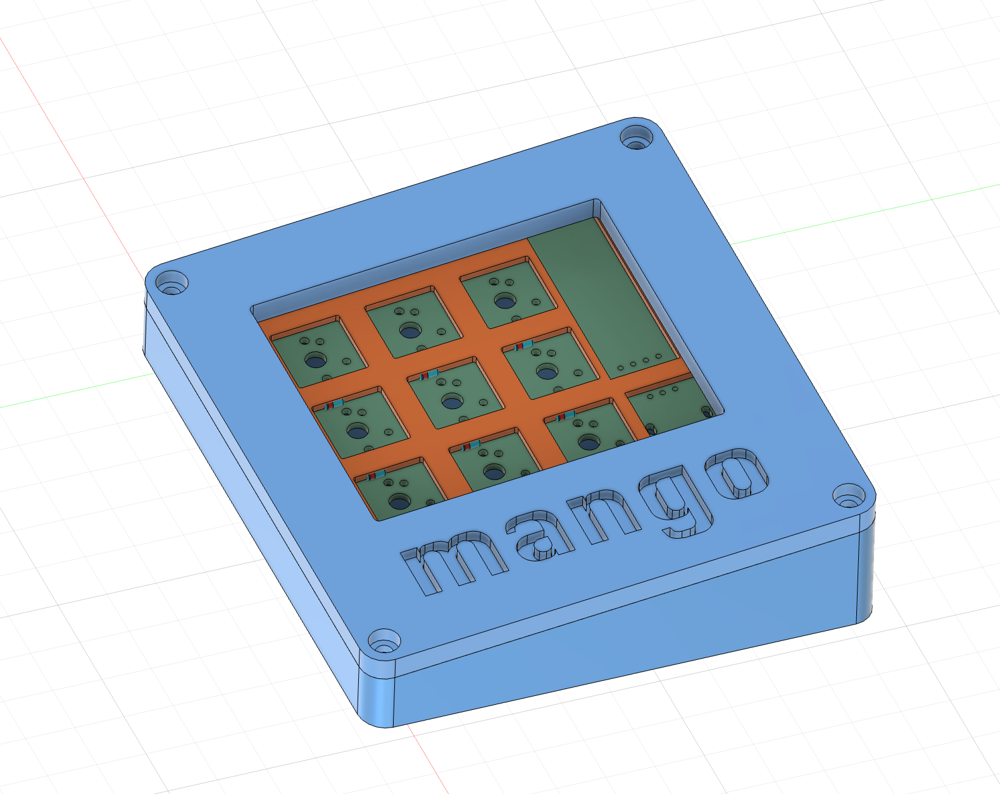

# mangopad

mangopad is a 9-key macropad with a Rotary Encoder, an OLED screen, and RGB. It was made as part of Hack Club's Highway YSWS.

# CAD
The case was designed in Fusion 360 and has 3 compartments: the top case, the plate, and the bottom case.

# PCB
The PCB was designed in KiCAD 

# Firmware
The firmware was written in Python, using the KMK library.

# BOM
- 4x Cherry MX Switches
- 4x DSA Keycaps
- 4x M3x5x4 Heatset Inserts
- 4x M3x16mm Screws
- 1x 0.91" 128x32 SSD1306 OLED Display
- 1x EC11 Rotary Encoder
- 1x XIAO RP2040
- 3D Printed Top, Plate, and Bottom

